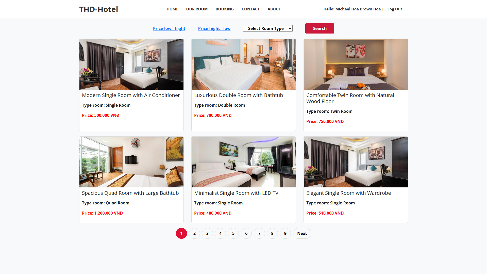
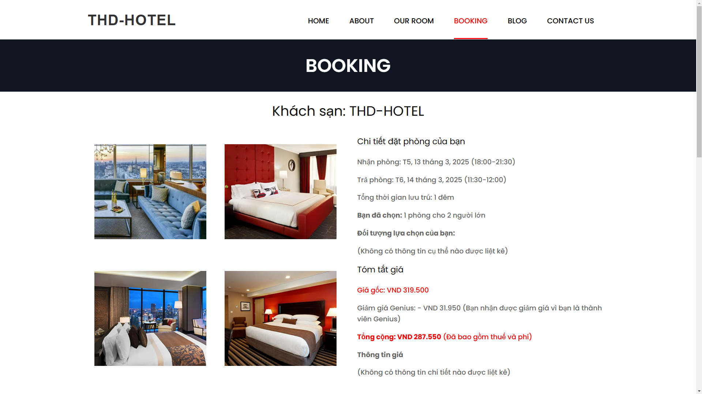
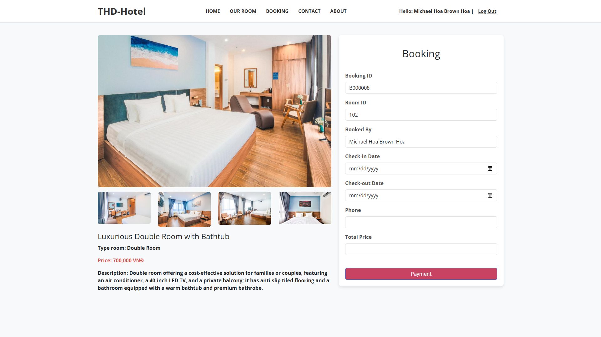
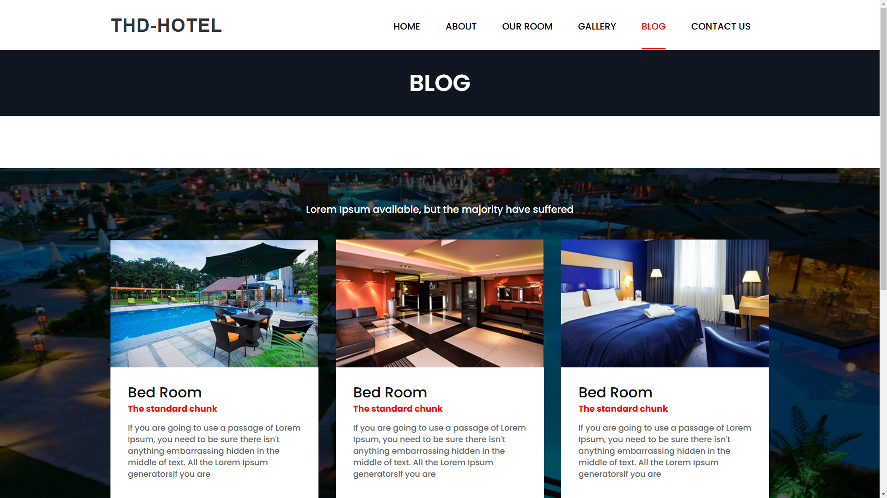
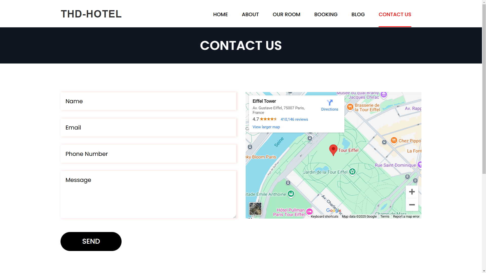
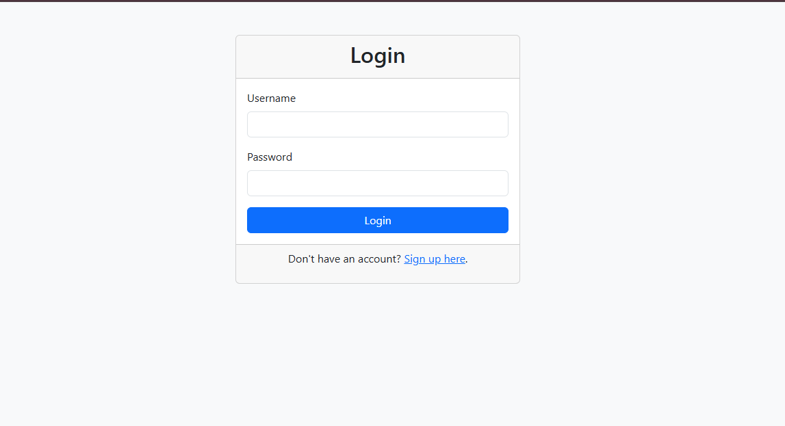
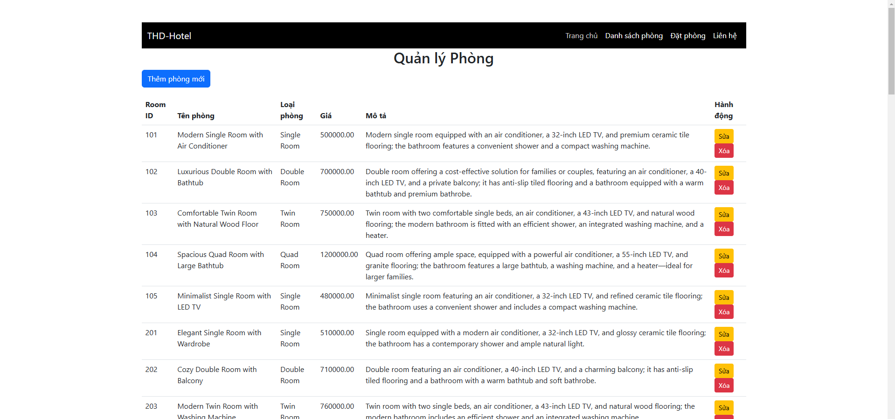
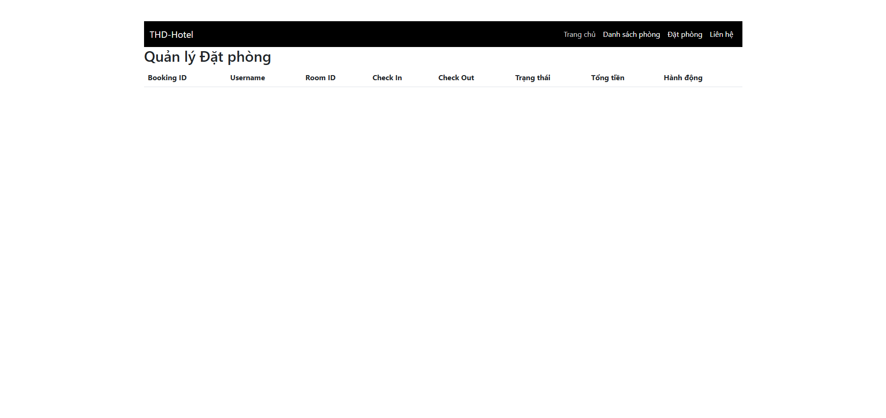
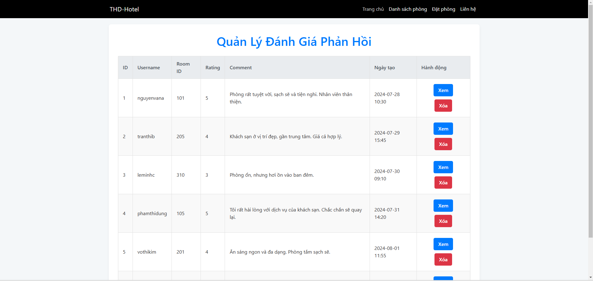

# **THD Hotel Management System**

| **Họ và Tên**       | **Mã số sinh viên**|
|---------------------|--------------------|
| **Lê Vũ Phương Hòa**|SE181951            |         
| **Ngô Thành Đạt**   |SE180026            | 
| **Trần Phú Thịnh**  |SE183355            | 

## **Introduction**
The **THD Hotel Management System** is a modern, web-based platform for managing hotel bookings, rooms, and payments. It offers tailored functionalities for guests, members, and administrators, ensuring an efficient and user-friendly experience.

---
## **I. REQUIREMENT**
## Purpose
- Allow users to browse and book hotel rooms effortlessly.
- Provide admins with tools to manage rooms, bookings, and reviews efficiently.
- Ensure secure payments and robust user authentication.

---

## Key Features by User Roles

### **1. Guest Features**
- View available rooms with basic details.
- Basic search functionality (search by name or price).
- Display clear error messages for invalid actions.

### **2. Member Features**
- Secure login/logout and full account access.
- Book, cancel, and confirm room bookings with real-time availability checks to ensure the room is not already booked.
  - If a room is unavailable, the system alerts the user to choose a different date or room.
- View booking costs and history.
- Post a review after using the room (optional).
- Filter room listings by price or alphabetical order.
- Password recovery for forgotten credentials.

### **3. Admin Features**
- Secure login/logout with full administrative access.
- Add, update, or delete room information.
- Manage all bookings, including cancellations and confirmations.
  - Admins can modify booking schedules if necessary.
- Admins can manage filtering conditions for room management.
- Monitor and respond to member reviews .
- Display clear error messages for invalid actions.

---

## System Requirements

- **Programming Language**: `Java`
- **Web Framework**: `Apache Tomcat`
- **Database**: `SQL Server`
- **Frontend**: `HTML`, `CSS`, `JavaScript`
- **Development Tools**:
  - `Visual Studio Code`
  - `NetBeans IDE`

## **II. GUI**
## Member

## Admin

