# **THD Hotel Management System**

| **Họ và Tên**       | **Mã số sinh viên**|
|---------------------|--------------------|
| **Lê Vũ Phương Hòa**|SE181951            |         
| **Ngô Thành Đạt**   |SE180026            | 
| **Trần Phú Thịnh**  |SE183355            | 

## **Introduction**
The **THD Hotel Management System** is a modern, web-based platform for managing hotel bookings, rooms, and payments. It offers tailored functionalities for guests, members, and administrators, ensuring an efficient and user-friendly experience.

---
## **I. REQUIREMENT**
## Purpose
- Allow users to browse and book hotel rooms effortlessly.
- Provide admins with tools to manage rooms, bookings, and reviews efficiently.
- Ensure secure payments and robust user authentication.

---

## Key Features by User Roles

### **1. Guest Features**
- View available rooms with basic details.
- Basic search functionality (search by name or price).
- Display clear error messages for invalid actions.

### **2. Member Features**
- Secure login/logout and full account access.
- Book and confirm room bookings with real-time availability checks to ensure the room is not already booked.
  - If a room is unavailable, the system will not display it in the list.
- View booking costs and history.
- Post a review after using the room (optional).
- Filter room listings by view or name.

### **3. Admin Features**
- Secure login/logout with full administrative access.
- Add, update, or delete room information.
- Manage all bookings, including cancellations and confirmations.
  - Admins can modify booking schedules if necessary.
- Admins can manage filtering conditions for room management.
- Monitor and respond to member reviews (optional).

### **4. System Requirements**

- **Programming Language**: `Java`
- **Web Framework**: `Apache Tomcat`
- **Database**: `SQL Server`
- **Frontend**: `HTML`, `CSS`, `JavaScript`
- **Development Tools**:
  - `Visual Studio Code`
  - `NetBeans IDE`

## **II. GUI**

---
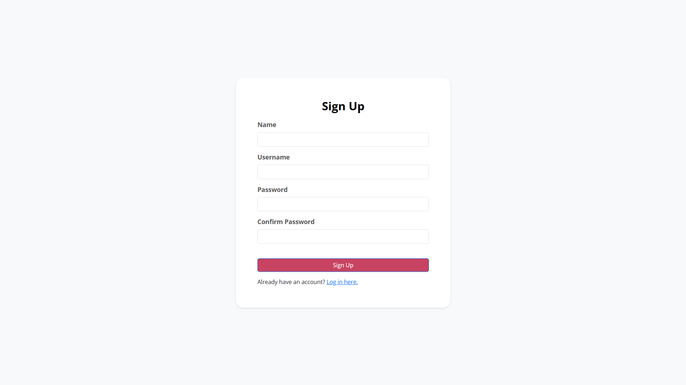
## Member

---
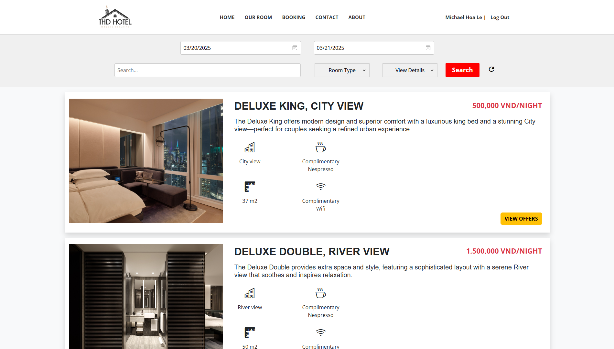
---

---
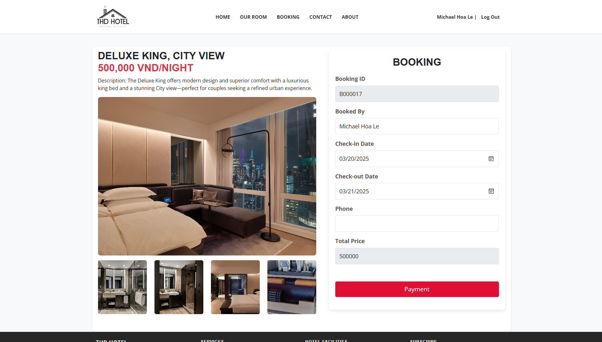
---
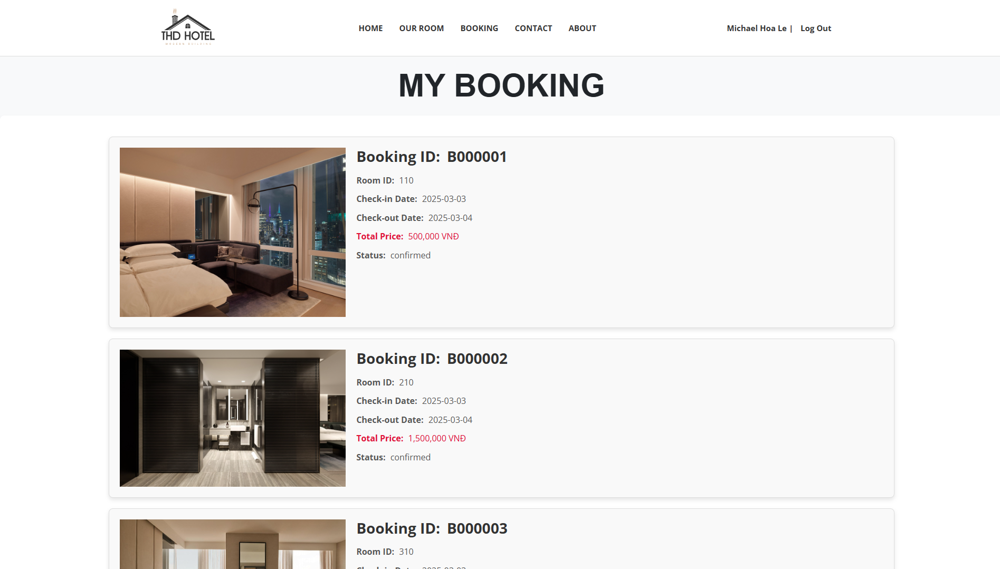
---
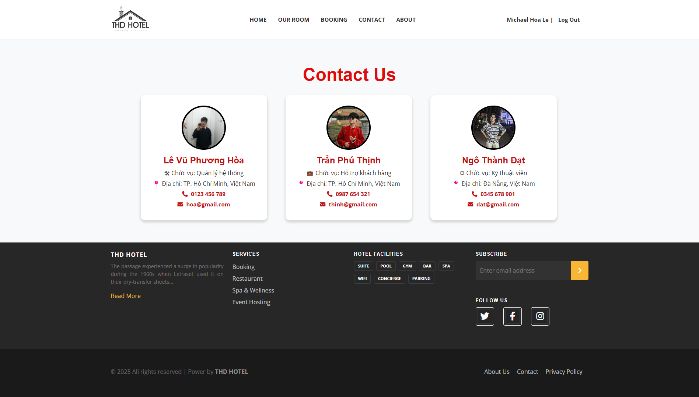
---
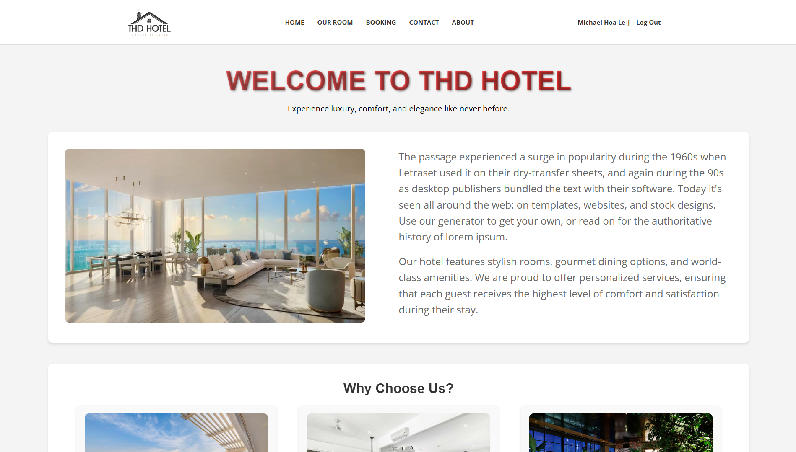
## Admin
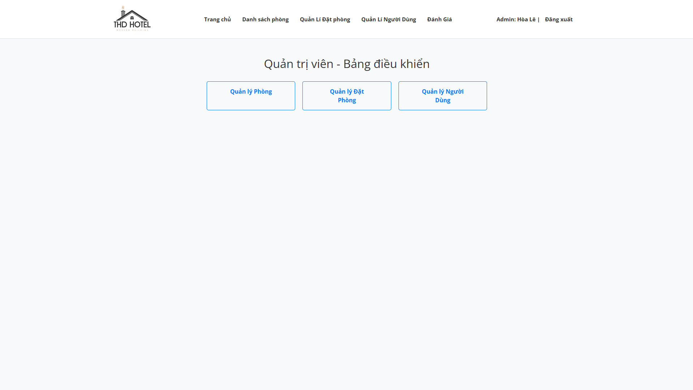
---
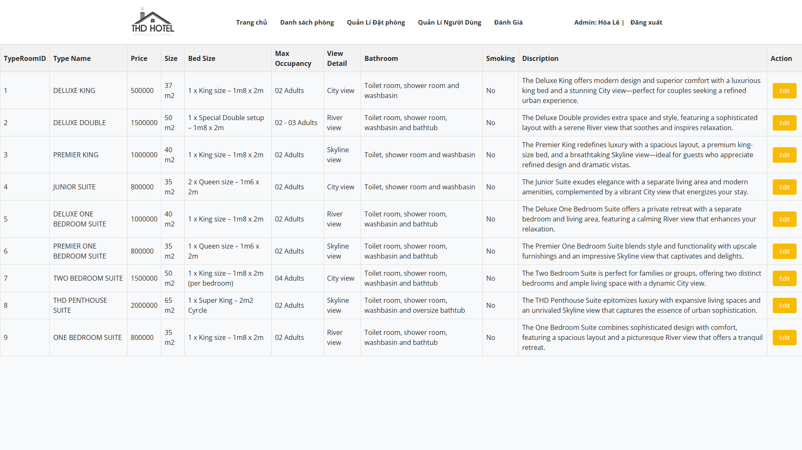
---
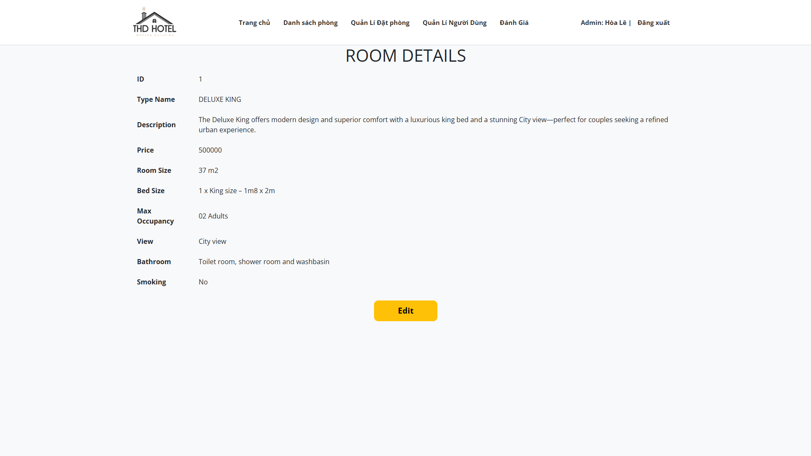
---
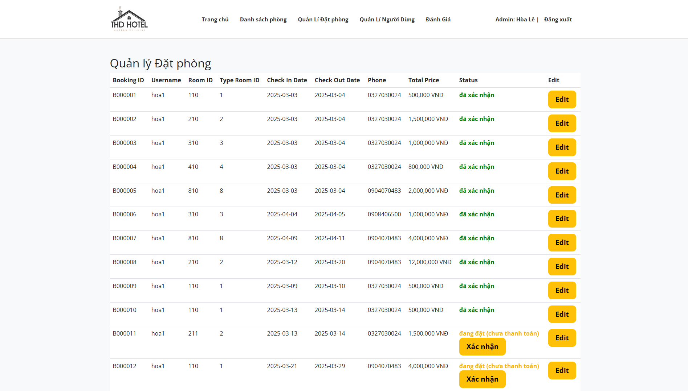
---
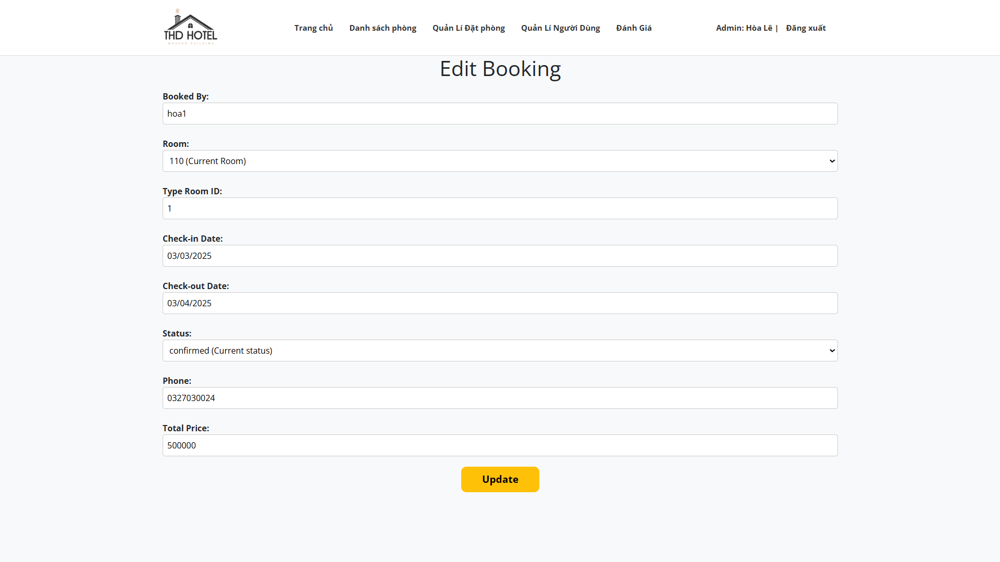
---

## **III. DATABASE**
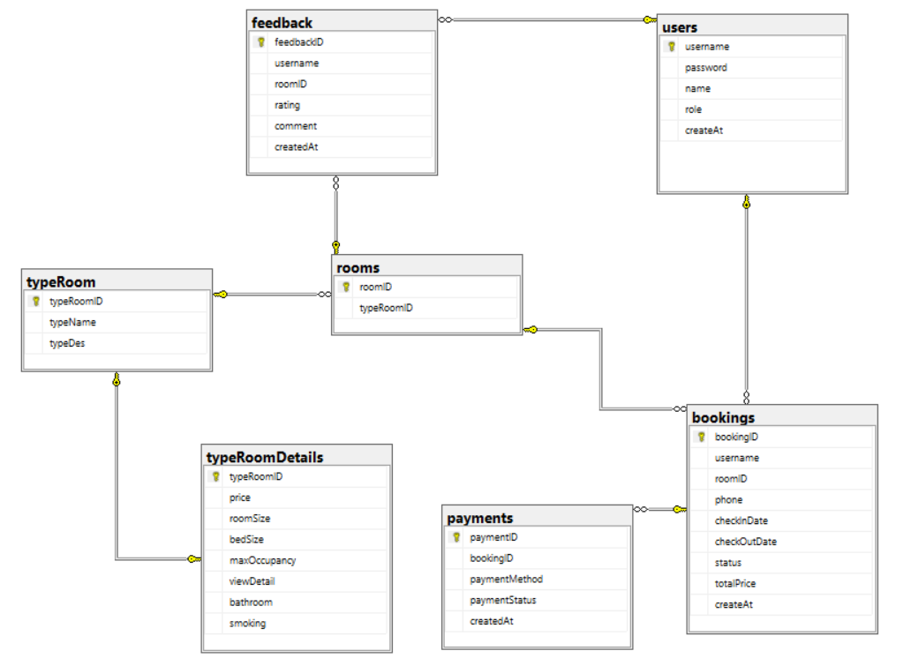

## **IV. SYSTEM DESIGN**
### **1. System structure**
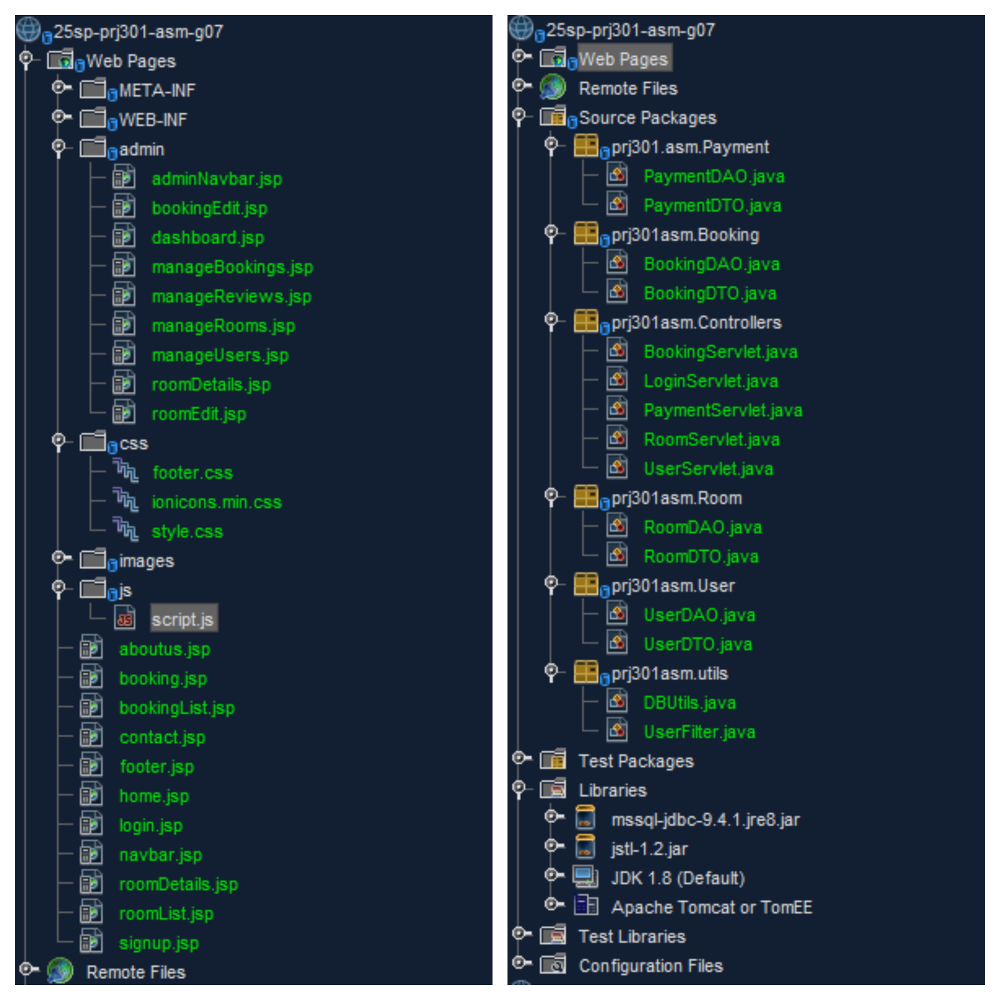

### **2. Flowchart**
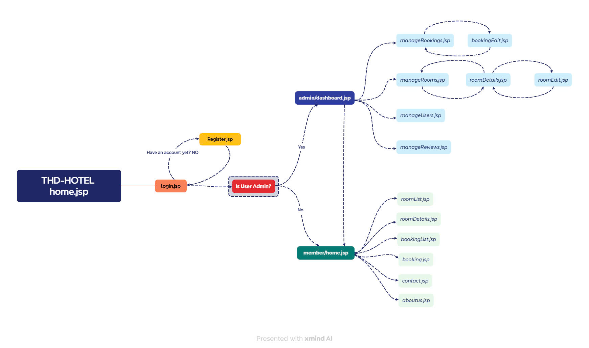

## **V. CONCLUSION AND DISCUSSION**
### **1. The pros and cons of our application**
- Pros: The advantage of our website is that it has an eye-catching, modern interface and is fully equipped with the basic functions of a website.

- Cons: The missing part of our website is about login via google, especially in the payment section when we cannot use external payment to help users pay in the smoothest way, instead we call users. And there is also a lack of user reviews about booked rooms.

### **2. What we have learned during the development of our application**
Through the project, my group learned how to start and practice web programming, everything must be planned step by step, not just code and code... After 10 weeks of studying with Mr. Dung, all members of the group can know how to divide the work, how to work together in groups for the most effective. The important thing is that our group has the opportunity to practice, the opportunity to dare to do things that our group thought would be very difficult, but in fact, if we just do and work hard, everything will be very simple, through those opportunities, the members of the group have improved a lot of programming skills, especially applying theories to practice. 
Here are some thoughts of the members of the group:

- Hoa: The moment Mr. Dung gave feedback on our team's database for the first time, because at that time our team had already completed 50% of the project but because we didn't check carefully, it took about 2 days and 2 nights to edit the database. It was really scary :<

- Dat:
After doing the project, I felt more clearly about my major, understood more clearly about what I would do with the direction of the major I had chosen. There are two difficulties that I felt the most:
  + One is how to work together in code without conflict, what each person's personal tasks will do, on my part, the leader does a very good job in this area, so everyone works together very effectively.
  + Two is from myself, I have to learn, fix bugs every night, web css every night, thanks to that I also understand more, know a lot more, the song at that time also improved my skills for now and in the future. What I think is not good is that I still do not have the ability to divide the work for everyone. The good part is that I have improved my ability to see and fix errors faster based on leetcode work, use github and work in groups on github

- Thinh: 
It can be said that this is one of my first projects. After completing this project, I have understood what teamwork is, how to support teammates, and improved my research skills to produce a product I am proud of today. Through this project, I've also realized that I still have many shortcomings:

  + I was the weakest member of the team. Initially, my knowledge of Java programming was almost zero. This was my biggest weakness, and I felt like a burden to the team. If I had given up, I might not have been able to complete the project as it is now, and perhaps I wouldn't be able to continue on this path. However, thanks to Hòa and Đạt — our leader and my teammates — who motivated me and helped me realize that it wasn't too late, that I could still try and make a comeback. As a result, I now understand what programming is and have grasped the logic through each piece of knowledge. The result is a project that exceeds my expectations.

  + Although I can now code on my own, I still struggle with fixing and debugging issues and identifying errors in my code through each deadline assigned by the leader. Therefore, I've tried to learn what it means to fix bugs, where to start, how to approach them, and, with the support of my teammates, I've improved my debugging skills for now and the future. I've also learned how to use GitHub to divide coding tasks and collaborate effectively as a team.

  + Through this project, I realize that I've improved significantly compared to before. However, I still need to learn more from my teammates, put more effort into research and practice to further develop my programming abilities.

### **3. What improvements can we make to our application in the future?**
- Firstly, we can upgrade the user interface by designing a responsive design that works seamlessly across different devices such as mobile phones, tablets and desktops, which will also improve accessibility. 
- Secondly, in the payment section, integrating popular online payment gateways such as PayPal, Stripe, MoMo or Visa/Mastercard will provide users with more convenient and secure payment options. Adding diverse payment methods such as QR codes or bank transfers can further enhance the payment experience.

- Finally, incorporating a user review system for booked rooms can help collect valuable feedback, build trust and increase engagement. These improvements aim to create a more user-friendly, secure and efficient platform for our customers.
